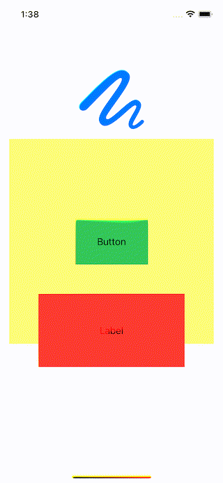

# WWPrivateView

[](https://developer.apple.com/swift/) [](https://developer.apple.com/swift/)  [](https://developer.apple.com/swift/) [](https://developer.apple.com/swift/)

### [Introduction - 簡介](https://swiftpackageindex.com/William-Weng)
- [Prevent system screenshot function.](https://blog.wyan.vip/2024/02/iOS_avoid_screen_capture.html)
- [防止系統擷圖功能。](https://www.bannerbear.com/blog/how-to-make-gifs-from-images-using-ffmpeg/)



### [Installation with Swift Package Manager](https://medium.com/彼得潘的-swift-ios-app-開發問題解答集/使用-spm-安裝第三方套件-xcode-11-新功能-2c4ffcf85b4b)

```bash
dependencies: [
    .package(url: "https://github.com/William-Weng/WWPrivateView.git", .upToNextMajor(from: "1.0.0"))
]
```

### Function - 可用函式
|函式|功能|
|-|-|
|appendSubView(_:)|加入不要被擷圖的View|

### Example
```swift
import UIKit
import WWPrivateView

final class ViewController: UIViewController {
    
    @IBOutlet weak var myImageView: UIImageView!
    @IBOutlet weak var myButton: UIButton!
    @IBOutlet weak var myLabel: UILabel!
    @IBOutlet weak var myPrivateView: WWPrivateView!
    
    override func viewDidLoad() {
        super.viewDidLoad()
    }
    
    override func viewDidAppear(_ animated: Bool) {
        super.viewDidAppear(animated)
        _ = myPrivateView.appendSubView(myButton)
        _ = myPrivateView.appendSubView(myLabel)
        _ = myPrivateView.appendSubView(myImageView)
    }
}
```
